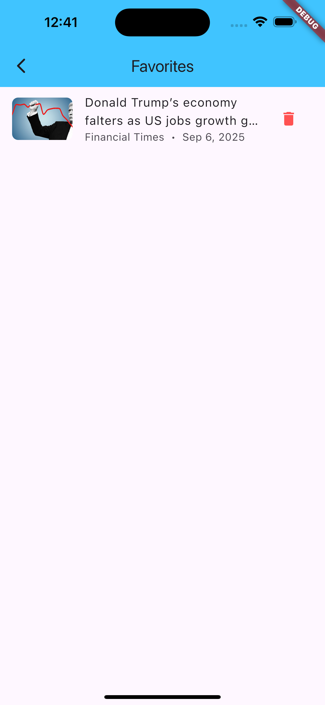

# 📰 News App  

[](https://flutter.dev/)  
[](https://docs.hivedb.dev/)  
[](https://bloclibrary.dev/#/)  
[](LICENSE)  
[](https://opensource.org/)  

---

## 📖 About  

**News App** is a modern **Flutter application** that delivers the latest news with an **elegant and intuitive user interface**.  
It provides features such as **article search**, **saving favorite articles**, and opening full content directly in the browser.  
Powered by **NewsAPI**, the app ensures a smooth and engaging news browsing experience.  

🔗 **Use case**: Built as a **portfolio project** & open-source example of scalable Flutter architecture.  

---

## ✨ Features  

✅ Fetch & display **top headlines**  
✅ **Carousel slider** for breaking news  
✅ Save articles locally with **Hive**  
✅ **Search functionality** on Home & Discover pages  
✅ Clean **drawer navigation**  
✅ **Notifications page** for recent headlines  
✅ Open full article with **URL launcher**  

---

## 🛠️ Tech Stack  

| Category          | Tools & Packages |
|-------------------|------------------|
| **Framework**     | Flutter `^3.9.0` |
| **Networking**    | Dio |
| **State Mgmt**    | flutter_bloc |
| **Local Storage** | Hive & hive_flutter |
| **UI Enhancements** | cached_network_image, carousel_slider |
| **Utilities**     | intl, flutter_dotenv, url_launcher |

---

## 📂 Project Structure  
```
lib/
│
├── core/ # Services, utils, constants, themes, routing
│
├── features/
│ ├── home/ # Top headlines & carousel
│ ├── search/ # Discover & search functionality
│ ├── favorites/ # Saved articles
│ └── notifications/ # Recent headlines
│
├── models/ # Data models (Article, Source)
│
└── main.dart # Entry point

```
---

## 📸 Screenshots  

*(Replace placeholders when you add screenshots to `/screenshots`)*  

| Home Page | Discover Page | Drawer |
|-----------|---------------|--------|
|  |  |  |

| Notifications | Saved Articles |
|---------------|----------------|
|  |  |

---

## ⚡ Getting Started  

### Prerequisites  
- [Flutter SDK](https://docs.flutter.dev/get-started/install)  
- [NewsAPI Key](https://newsapi.org/)  

### Installation  

# Clone the repository
git clone https://github.com/EngYoussefElghanam/news_app.git

# Navigate into the project
cd news_app

# Install dependencies
flutter pub get

# Add your API key in .env
echo "NEWS_API_KEY=your_api_key_here" > .env

# Run the app
flutter run
# 🚀 Roadmap
 Dark mode support

 Category-based filtering (Sports, Tech, etc.)

 Push notifications for breaking news

# 🙌 Acknowledgements
NewsAPI for article data

Flutter & open-source packages

# 📜 License
This project is licensed under the MIT License – see the LICENSE file for details.

